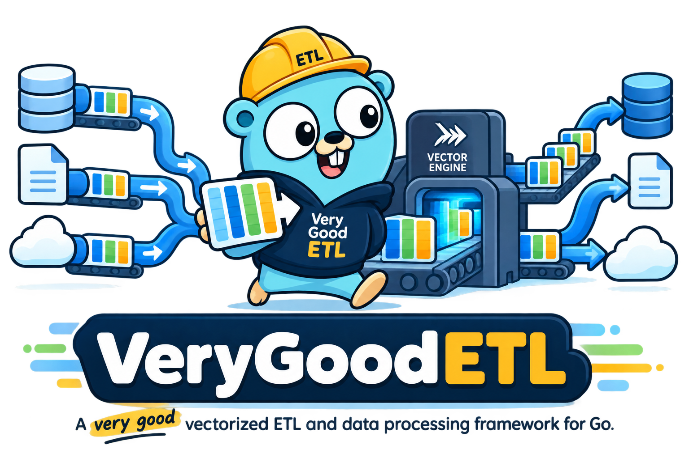

# Very Good ETL



Very Good ETL is a vectorized ETL and data processing framework for Go. It is used for building concurrent, batch-oriented data pipelines. Apache Arrow records are the initial execution representation, while the runtime provides the graph, lifecycle, backpressure, cancellation, and ownership semantics around them.

Use our software, or do not. We are not beggars.

## Status

Very Good ETL is under active design. The initial runtime is intentionally small while its execution semantics are proven.

## Design goals

- Process typed data in batches rather than row-at-a-time payloads.
- Build pipelines as DAGs with first-class fan-out and fan-in.
- Preserve the useful `Process` / `Finish` lifecycle: `Finish` runs only after every upstream input has completed successfully.
- Apply bounded backpressure between stages.
- Cancel the entire graph on the first error or context cancellation.
- Make raw archival a natural side output so derived reporting data can be rebuilt from durable source data.
- Remain a processing library, not a scheduler. A Very Good ETL pipeline should be easy to compile into a normal Go binary and invoke from Sidekiq, cron, Airflow, a Kubernetes Job, or whatever already schedules work.

## Installation

```sh
go get github.com/verygoodetl/verygoodetl
```

The package name is `etl`. Because the import path's last segment
(`verygoodetl`) doesn't match, `goimports` will add an explicit alias:

```go
import etl "github.com/verygoodetl/verygoodetl"
```

## Core model

A pipeline is a directed graph of sources, processors, and sinks:

```text
                     +--> raw archive
                     |
source --> batches --+--> validate --> transform --> reporting database
                     |
                     +--> another processor --> another sink
```

The unit moving between stages is a `Batch`. The initial `Batch` implementation wraps an Apache Arrow record.

```go
type Processor interface {
    Process(context.Context, etl.Batch, etl.Output) error
    Finish(context.Context, etl.Output) error
}
```

`Process` may emit zero or more batches. `Finish` is called exactly once after all upstream inputs have closed successfully and no future call to `Process` can occur.

## Example

```go
pipeline := etl.New(etl.WithBufferSize(8))

orders := pipeline.From(source)

// CopyTo preserves the stream while sending the same immutable batches to a
// side sink. This is a logical copy; Arrow buffers may be shared in memory.
orders.CopyTo(rawArchive)

clean := orders.Process(cleanOrders)
clean.To(reportingDatabase)

if err := pipeline.Run(ctx); err != nil {
    return err
}
```

Fan-in is explicit:

```go
allOrders := pipeline.Merge(mergeProcessor, webOrders, storeOrders)
allOrders.To(sink)
```

`mergeProcessor.Finish` will not run until both `webOrders` and `storeOrders` have finished successfully.

## Writing files

The `filesink` subpackage provides a `Sink` that writes batches to a single Parquet, Arrow IPC, or CSV file, stored via [`gocloud.dev/blob`](https://gocloud.dev/howto/blob/) so the same code targets S3, GCS, or local disk by changing the bucket URL. It depends only on `gocloud.dev/blob`'s core types, never a cloud SDK directly. `filesink.CSV()` defaults to RFC 4180 encoding — minimal quoting, doubled-quote escaping — and derives column order and NULL handling from the schema rather than sniffing the data. Two options exist for consumers that can't process compliant CSV: `WithEscapeCharacter` (e.g. a backslash instead of a doubled quote) and `WithAlwaysEncapsulate` (quote every field, not just ones that need it) — both are opt-in and off by default.

```go
import (
    "gocloud.dev/blob"
    _ "gocloud.dev/blob/s3blob" // or gcsblob, fileblob, ...

    "github.com/verygoodetl/verygoodetl/filesink"
)

bucket, err := blob.OpenBucket(ctx, "s3://my-bucket?region=us-west-2")
if err != nil {
    return err
}

orders.CopyTo(filesink.New(bucket, "orders.parquet", filesink.Parquet()))
```

By default, writing to an existing key overwrites it — the usual expectation for generated output like a report or a staging file ahead of a database load. For durable, archival-style writes where a key must never be silently overwritten, opt in explicitly:

```go
orders.CopyTo(filesink.New(bucket, "orders.parquet", filesink.Parquet(),
    filesink.WithWriterOptions(&blob.WriterOptions{IfNotExist: true})))
```

## SQL source

The `sqlsource` subpackage provides a `Source` that runs a SQL query via the standard library's `database/sql` and emits the results as Arrow batches. Column types are driven by a caller-supplied schema, never inferred from driver metadata — `database/sql`'s optional type-inference hooks are inconsistently implemented across drivers, so this package takes no dependency on any specific driver and asks for an explicit `*arrow.Schema` instead.

```go
import (
    "database/sql"

    _ "modernc.org/sqlite" // or any database/sql driver

    "github.com/verygoodetl/verygoodetl/sqlsource"
)

db, err := sql.Open("sqlite", "file:orders.db")
if err != nil {
    return err
}

source, err := sqlsource.New(db, "SELECT id, name FROM orders", schema)
if err != nil {
    return err
}

orders := pipeline.From(source)
```

`sqlsource.Lookup` runs a dynamically generated query per incoming batch against a (possibly different) database — for example, using a batch of IDs from one database to look up matching rows in a second, unconnected database that can't be joined with a single SQL statement. `Lookup` replaces the stream with its own results rather than merging them; to combine the original batch with a `Lookup`'s results, attach both to a `Pipeline.Merge` and do the combination there — see `examples/sql-lookup-merge`.

`sqlsource.LookupKeys(batch, column)` extracts a column's non-null, de-duplicated values from a batch — the args for an `IN (...)` clause — so a `QueryGenerator` doesn't need to hand-roll that extraction loop itself:

```go
generate := func(b etl.Batch) (string, []any, error) {
    args, err := sqlsource.LookupKeys(b, 0)
    if err != nil {
        return "", nil, err
    }
    // ...build "WHERE id IN (?, ?, ...)" with len(args) placeholders...
    return query, args, nil
}
lookup, err := sqlsource.NewLookup(secondDB, generate, resultSchema)
if err != nil {
    return err
}

matches := orders.Process(lookup)
combined := pipeline.Merge(combiner, orders, matches)
```

## Examples

The `examples` directory has complete, runnable programs (`go run ./examples/<name>`) for common pipeline shapes:

- `archive-fanout` — a source fanning out to both a durable archive (`filesink` with `IfNotExist` opted in) and a processed sink.
- `sql-to-sink` — a SQL source with no archival step.
- `sql-to-archive` — extract from SQL, archive the raw batches, and process the same stream into a reporting sink.
- `sql-lookup-merge` — query two unconnected databases and combine the results in Go via `sqlsource.Lookup` and `Pipeline.Merge`.

## Batch ownership

Batches are immutable from the runtime's point of view. This allows a batch to fan out without copying its Arrow buffers.

`Output.Send` retains one reference for each downstream edge. The downstream runtime releases that reference after the receiving processor or sink returns. Code that creates an Arrow record remains responsible for its own original reference.

## What is deliberately not here yet

- SQL sinks
- CSV source (reading)
- expression or vector-compute DSL
- joins, aggregation, sorting, and other higher-level processors
- scheduling or orchestration
- completion manifests and replay tooling for archived data

Those should be built on top of a runtime whose semantics are boring and correct.

## Philosophy

Raw source data should be durable. Reporting databases should be rebuildable derived artifacts.

Extract once. Preserve the source. Process in batches. Compose freely. Transform deterministically. Rebuild anything.
